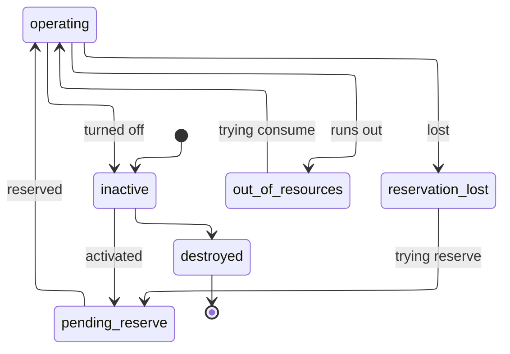

### Building state machine

```mermaid
---
config:
  layout: elk
---
stateDiagram
  direction TB
  [*] --> inactive
  inactive --> pending_reserve:activated
  pending_reserve --> operating:reserved
  operating --> out_of_resources:runs out
  operating --> reservation_lost:lost
  operating --> inactive:turned off
  reservation_lost --> pending_reserve:trying reserve
  out_of_resources --> operating:trying consume
  inactive --> destroyed
  destroyed --> [*]
```
